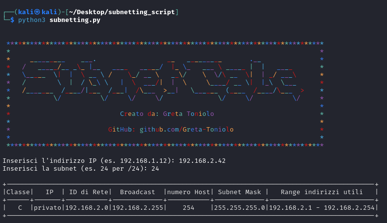

# Subnetting Calculator

Uno script Python per calcolare la subnet in base all'**indirizzo IP** e alla **maschera di rete** forniti dall'utente.

L'output genera:

- **Classe dell'IP:** Indica la classe a cui appartiene l'indirizzo IP (A, B o C).

- **Tipologia di IP (Privato/Pubblico):** Indica se l'indirizzo IP è privato o pubblico.

- **ID di Rete:** È l'indirizzo di rete derivato dall'IP e dalla maschera di rete forniti.

- **Broadcast:** Indica l'indirizzo di broadcast della subnet.

- **Numero di Host Disponibili:** Indica quanti host possono essere utilizzati all'interno della subnet.

- **Subnetmask della Rete:** Rappresenta la maschera di rete in formato decimale puntato.

- **Range di Indirizzi Utilizzabili:** Indica l'intervallo di indirizzi IP utilizzabili all'interno della subnet.

## Installazione

- Clonare la repository

```bash
git clone https://github.com/Greta-Toniolo/Subnetting-Calculator
```


- Assicurati di avere Python installato. Puoi scaricare Python dal [sito ufficiale](https://www.python.org/).

- Successivamente, installa le dipendenze eseguendo il seguente comando a terminale dentro la cartella 'subnetting_script':

```bash
pip install -r dependences.txt
```

## Utilizzo

Per eseguire lo script, utilizza il seguente comando:

```bash
python3 subnetting.py 
```




